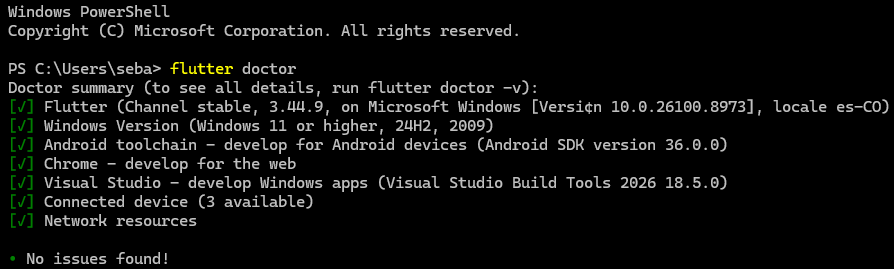
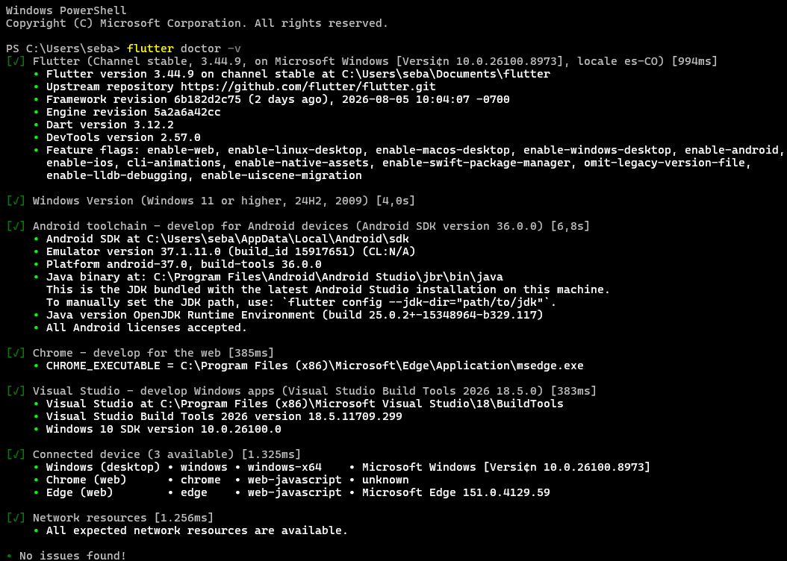

# flutter_first_proyect 📱

Primera aplicación de Flutter.

Este proyecto tiene el objetivo es preparar un entorno de desarrollo Flutter funcional y crear el primer proyecto base con `flutter create`.

Primera aplicación de Flutter, desarrollada como parte del curso **Programación Móvil (SS603)** — Semana 1: *El panorama móvil en 2026*.

Este proyecto corresponde a la entrega **E01 – Entorno listo y proyecto inicial**, cuyo objetivo es preparar un entorno de desarrollo Flutter funcional y crear el primer proyecto base con `flutter create`.

## 🚀 Tecnologías

- **Flutter** (Channel stable, 3.44.9)
- **Dart** 3.12.2
- **Android SDK** 36.0.0
- **Visual Studio Build Tools 2026** (para desarrollo en Windows)
- **Windows 11** (24H2)

## ✅ Verificación del entorno

Antes de comenzar el desarrollo, se validó que el entorno estuviera correctamente configurado usando `flutter doctor`:

**`flutter doctor`**



**`flutter doctor -v`** (detalle ampliado)



## 📂 Estructura del proyecto

Proyecto generado con la estructura estándar de `flutter create`:

```
flutter_first_proyect/
├── android/        # Configuración nativa para Android
├── ios/            # Configuración nativa para iOS
├── lib/
│   └── main.dart   # Punto de entrada de la aplicación
├── test/           # Pruebas unitarias/widget
├── web/            # Configuración para despliegue web
├── windows/        # Configuración nativa para Windows desktop
├── pubspec.yaml    # Dependencias y metadatos del proyecto
└── README.md
```

## ⚙️ Cómo ejecutar el proyecto

1. Clona el repositorio:
   ```bash
   git clone https://github.com/zeb064/flutter_first_proyect.git
   cd flutter_first_proyect
   ```

2. Instala las dependencias:
   ```bash
   flutter pub get
   ```

3. Verifica que tu entorno esté listo:
   ```bash
   flutter doctor
   ```

4. Ejecuta la aplicación (elige el dispositivo/plataforma disponible):
   ```bash
   flutter run
   ```

   ```

## 🎯 Objetivos de la semana 1 (RAA1)

- Distinguir aplicaciones nativas, híbridas, multiplataforma y PWA con criterios de ingeniería.
- Justificar la elección de una tecnología según rendimiento, acceso a hardware, equipo y costo de mantenimiento.
- Preparar un entorno de desarrollo Flutter funcional.

## 👤 Autor

**zeb064** — Programación Móvil SS603 · 2026-2

